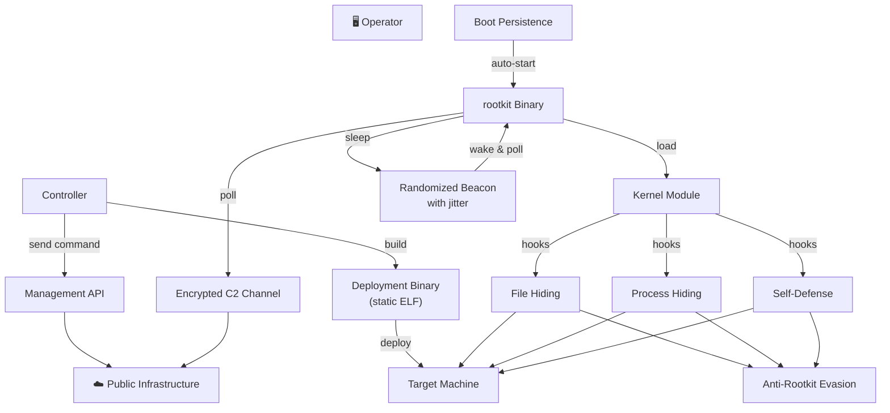

<h1 align="center">NEPHILM</h1>
<h4 align="center">Kernel-level rootkit for modern Linux — ftrace-based syscall hooking, DNS-based C2 over DoH (DNS-over-HTTPS), one-way shell, machine-specific artifact naming, randomized beaconing with jitter, and fully static deployment.</h4>

---

## DESCRIPTION

NEPHILM is a kernel-level rootkit for modern Linux that operates through ftrace-based syscall hooking. Unlike userland rootkits detectable by file integrity monitoring or process enumeration, NEPHILM embeds itself into the kernel's execution path — intercepting filesystem operations, process listings, and module enumeration before they reach userspace tools.

The rootkit binary masquerades as a legitimate system component, blending into the noise of hundreds of similar processes on a typical Linux box. Once executed with appropriate privileges, it loads a kernel module that hooks multiple kernel functions via the Linux ftrace framework — a legitimate kernel tracing mechanism repurposed for interception. No kernel patching, no DKMS registration. The module compiles on-target against the machine's exact kernel headers, ensuring compatibility and leaving no pre-compiled binary signatures.

**Command-and-control runs over DNS-over-HTTPS (DoH).** The rootkit polls a public DoH resolver over TLS port 443 — indistinguishable from normal HTTPS traffic. Commands are hex-encoded and split across DNS MX records on a controller-managed domain, with an end-marker label to signal command completion. There are no listening ports, no custom protocols, no direct operator-to-target connections. Every packet looks like a routine HTTPS DNS query. Between polling cycles, the rootkit generates zero network traffic — complete radio silence.

Both the **deployment binary** and the **rootkit binary** are fully statically linked — zero runtime dependencies. The entire deployment runs on a bare Linux install with nothing installed beyond what ships with the kernel.

**How does it stay hidden?** Every installed artifact is machine-specific. No two infected machines share the same binary name, module path, persistence entry, or config directory. File timestamps are cloned from legitimate system files to resist forensic timeline analysis. The kernel module auto-hides all rootkit paths on every boot and whitelists its own PID so the rootkit can function while remaining invisible to standard system tools and any EDR scanning `/proc`. Multiple rootkit detection tools return clean results.

**Persistence** is handled through a hidden system scheduler entry that sources shell profiles. The deployment binary is a single statically-linked ELF with encrypted payloads — no dependencies, no package manager noise. Between machine-specific naming, timestamp cloning, and per-build encryption, static analysis of the deployment binary yields nothing actionable.

---

## Architecture

---

## Features

### C2 Commands
| Command | Description |
|---|---|
| Any shell command | One-way shell — receive and execute |

### C2 Protocol
- **DNS-over-HTTPS (DoH)** — All C2 traffic over TLS port 443, indistinguishable from normal HTTPS
- **MX record encoding** — Commands are hex-encoded and distributed across DNS MX records
- **End marker** — Each command terminates with a configurable marker so the rootkit knows exactly when a command is complete — no wasted fetch cycles
- **No listening ports** — Pure outbound HTTPS, nothing inbound
- **Network profile** — Indistinguishable from a system performing DoH DNS resolution

### Stealth — Syscall Hooking
Multiple syscalls intercepted via ftrace before they reach userspace, covering:
- **File access** — Blocked for hidden paths
- **File metadata** — Returns errors for hidden paths; post-corrected to defeat enumeration
- **Directory listings** — Filtered to exclude hidden entries
- **Process inspection** — Debugger attachment, PID existence checks, and enumeration blocked for rootkit process
- **Module loading** — Pass-through — legitimate kernel modules load normally

### Stealth — Self-Defense
- **Introspection blocking** — Module invisible to kernel symbol enumeration and module discovery
- **Symbol suppression** — Module symbols hidden from kernel symbol table
- **Log sanitization** — All kernel log output stripped from module
- **PID hiding** — rootkit PID hidden from process listings, `/proc` traversal, and signal checks
- **Path normalization** — All hidden paths registered for both traditional and merged filesystem layouts
- **Module retry** — Auto-retries kernel module load if initial attempt fails
- **Auto-load on boot** — Module compiles and loads automatically on startup
- **Kernel upgrade resilience** — Module source persisted to hidden directory; auto-detects kernel version changes and recompiles on-the-fly
- **Secret unload** — Control interface requires machine-specific key to unload

### Anti-Rootkit Evasion
NEPHILM bypasses all major Linux rootkit detection tools including **chkrootkit** (chkproc, chkdirs), **rkhunter**, and **unhide** (proc, brute). Both `chkrootkit` and `rkhunter` return clean results with no warnings or detections.

### Beaconing
- **Randomized intervals** — Polls at random intervals between configurable min/max values
- **Jitter** — Additional random sub-second delay per cycle to defeat timing analysis
- **Configurable per rootkit** — Each infected machine can have different beacon timing
- **Zero traffic between polls** — Complete network silence during sleep cycles

### Anti-Forensics
- **Machine-specific naming** — Every artifact name is unique per host, derived from system identifiers
- **Timestamp spoofing** — rootkit files cloned from legitimate system file timestamps
- **Encrypted payloads** — rootkit binary encrypted (per-build key), module source encrypted
- **Binary obfuscation** — Header corruption, string obfuscation at rest
- **Build artifact cleanup** — All intermediate build files deleted after compilation

### Build-Time Diversity
Every build produces unique binary artifacts — no two deployments share the same hash.

| Layer | Scope | Mechanism |
|---|---|---|
| Dead-code injection | Per-machine | Unique static functions with randomized names injected into module sources |
| Encryption keys | Per-build | rootkit binary encryption key randomized every controller build |
| Compiler variation | Per-machine | Randomized optimization level plus random alignment flags |
| Binary mutation | Per-machine | Random section appended to compiled module with per-machine ID |
| Build path variation | Per-machine | Randomized temporary paths prevent reproducible builds |

### Fully Static Binaries
Both the deployment binary and the rootkit binary are fully statically linked — zero runtime dependencies. Deploy on any Linux x86_64 system with nothing installed beyond what ships with the kernel.

---

## Requirements

### Target Machine
- Linux kernel 4.17–6.x (x86_64)
- Root access
- Kernel headers installed (`linux-headers-$(uname -r)`) — auto-installed by dropper if missing

### Controller
- Python 3.13+
- Cloudflare account with API token (DNS edit permissions)
- Domain managed by Cloudflare
- `g++` (C++17)
- `cmake` (3.14+)
- `upx` (optional, for dropper compression)
- OpenSSL development headers (`libssl-dev`)
- Standard build tools (`make`, `tar`)

### INSTALLATION
    git clone https://github.com/0xbitx/DEDSEC_NEPHILM.git
    cd DEDSEC_NEPHILM
    sudo apt install libssl-dev
    chmod +x dedsec_nephilm
    sudo ./dedsec_nephilm
    
### TESTED ON FOLLOWING
* Kali Linux 
* Parrot OS
* Ubuntu
  
## Legal Disclaimer

This tool is intended for educational and security research purposes only. Unauthorized usage may be illegal in your jurisdiction. The author is not responsible for any misuse of this tool.
