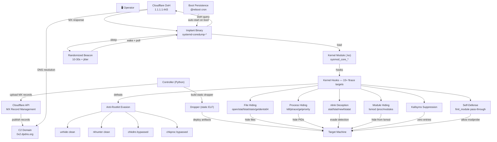

<p align="center">

</p>

<h1 align="center">NEPHILM</h1>
<h4 align="center">Kernel-level rootkit for modern Linux (4.17–6.x) — ftrace-based syscall hooking, machine-specific artifact naming, DNS-over-HTTPS C2, randomized beaconing with jitter, and fully static zero-dependency dropper.
</h4>

---

## DESCRIPTION

NEPHILM is a kernel-level rootkit for modern Linux (4.17–6.x) that operates through ftrace-based syscall hooking. Unlike userland rootkits that can be detected by file integrity monitoring or process enumeration, NEPHILM embeds itself into the kernel's execution path — intercepting filesystem operations, process listings, and module enumeration before they reach userspace tools.

The rootkit binary masquerades as a legitimate system component (`systemd-coredump-*`), blending into the noise of hundreds of similar processes on a typical Linux box. Once executed with root privileges, it loads a kernel module that hooks 15+ kernel functions via the Linux ftrace framework — a legitimate kernel tracing mechanism repurposed for interception. No kernel patching, no DKMS registration, no suspicious entries in `lsmod` or `/sys/module`. The module compiles on-target against the machine's exact kernel headers, ensuring compatibility and leaving no pre-compiled binary signatures.

Command-and-control runs over **DNS-over-HTTPS** (DoH). The rootkit polls Cloudflare's `1.1.1.1` DoH resolver over TLS port 443 — indistinguishable from normal HTTPS traffic. Commands are split across DNS MX records on a controller-managed domain, hex-encoded with an end-marker label to signal command completion. There are no listening ports, no custom TCP protocols, no direct operator-to-target connections. Every packet looks like a routine HTTPS request to Cloudflare DNS. Between polling cycles, the rootkit generates zero network traffic except a single-packet TCP connectivity check — complete radio silence.

**What can it do?** The rootkit provides a full one-way shell. Any command sent via the C2 channel is executed via `/bin/sh -c` as a detached daemon process. Built-in `cd` and `pwd` provide directory navigation. Commands execute in 30-second timeout windows with output truncated for efficiency.

**How does it stay hidden?** Every installed artifact is machine-specific. No two infected machines share the same binary name, module path, persistence entry, or config directory. File timestamps are cloned from legitimate system files to resist forensic timeline analysis. The kernel module auto-hides all rootkit paths on every boot and whitelists its own PID so the rootkit can operate while remaining invisible to `find`, `ls`, `ps`, `top`, `stat`, `kill`, and any EDR scanning `/proc`. Rootkit detection tools — including **chkrootkit**, **rkhunter**, and **unhide** — return clean results with zero warnings. Full merged-usr support ensures paths are correctly hidden whether `/lib` is a symlink to `/usr/lib` or not.

**Persistence** is handled through a hidden `@reboot` cron entry that sources the user's shell profiles so environment variables propagate correctly. The dropper binary is a single **fully static** ELF — zero runtime dependencies, no package manager noise beyond optional kernel header installation. Between the machine-specific naming, timestamp cloning, and per-build XOR encryption of embedded payloads, static analysis of the dropper yields nothing actionable.

---

## Architecture



---

## Features

### C2 Commands
| Command | Description |
|---|---|
| Any shell command | Executed via `/bin/sh -c` with 30s timeout |

### C2 Protocol
- **Transport** — DNS-over-HTTPS (RFC 8484) to Cloudflare `1.1.1.1:443`
- **Encoding** — plaintext command → hex-encoded → split across MX record labels (60-char max per label, 255-char max hostname)
- **End marker** — final MX record carries a distinguishable label before the domain; rootkit stops fetching immediately without probing for "does N+1 exist?"
- **Single TLS connection** — all MX queries per polling cycle sent over one TLS session, not one-per-query
- **IPv4 only** — no IPv6 footprint, reduced attack surface
- **Randomized polling** — configurable min/max interval (10–30s default) + 0–999ms jitter per cycle

### Stealth
| Layer | Hooks | Effect |
|---|---|---|
| **File hiding** | `open`, `stat`, `lstat`, `statx`, `access`, `openat`, `getdents64`, `chdir`, `chmod`, `chown`, `newfstatat` | All rootkit files invisible to `ls`, `find`, `stat` |
| **Process hiding** | `kill`, `ptrace`, `getpriority`, `getdents64` | Rootkit PID hidden from `ps`, `/proc`, `kill -0`, `pgrep` |
| **Module hiding** | `hide_module` (list manipulation) | Module invisible to `lsmod`, `/proc/modules`, `/sys/module` |
| **nlink deception** | `stat`, `lstat`, `newfstatat` | Directory link counts post-corrected to defeat enumeration |
| **Kallsyms suppression** | `num_symtab` zeroed | Zero module entries in `/proc/kallsyms` |
| **dmesg sanitization** | All `printk` stripped | No references in `dmesg` output |
| **Merged-usr** | Auto `/usr` prefix mirroring | Hiding `/bin/x` also hides `/usr/bin/x` and vice versa |
| **Anti-debug** | `ptrace` hook | Debugger attachment blocked on rootkit process |
| **finit_module** | Pass-through hook | Legitimate `modprobe`/`insmod` operations work normally |

### Anti-Rootkit Evasion
NEPHILM bypasses all major Linux rootkit detection tools including **chkrootkit** (chkproc, chkdirs), **rkhunter**, and **unhide** (proc, brute). All return clean results with zero warnings or detections.

### Self-Defense
- **Secret unload** — `/proc/sysmod_ctl_*` requires machine-specific key to unload module
- **Module retry** — auto-retries kernel module load every 30 seconds if initial attempt fails
- **Kernel upgrade resilience** — module source tarball persisted to hidden directory; implant auto-detects kernel version changes and recompiles on-the-fly

### Beaconing
- **Randomized intervals** — polls DoH at random intervals between configurable min/max values
- **Millisecond jitter** — 0–999ms random jitter added to each poll cycle to prevent timing analysis
- **Zero traffic between polls** — complete network silence during sleep, single-packet connectivity check
- **Configurable per build** — min/max values set in controller, baked into binary at compile time
- **Network profile** — bursts of HTTPS to `1.1.1.1:443` at irregular intervals, identical to browser DNS-over-HTTPS traffic

### Anti-Forensics
- **Machine-specific naming** — every artifact name is unique per host, derived from `/etc/machine-id` via FNV-1a hash
- **Merged-usr support** — paths auto-registered for both `/lib/`/`/bin/` and `/usr/lib/`/`/usr/bin/` variants
- **Timestamp spoofing** — rootkit files cloned from legitimate system file timestamps (`/bin/ls`, `/etc/systemd/system.conf`)
- **Per-build payload encryption** — rootkit binary XOR-encrypted with random 32-byte key before embedding in dropper; kernel module tarball encrypted with separate fixed key
- **Static dropper** — single ELF binary, zero `.so` dependencies, runs on any x86_64 Linux

### Build-Time Diversity
Every build and deployment produces unique binary artifacts.

| Layer | Mechanism |
|---|---|
| Rootkit binary encryption | 32-byte random XOR key per build |
| Kernel module encryption | Hardcoded 32-byte XOR key for tarball |
| Dead-code injection | 2–3 unique static functions with randomized names injected per machine |
| Compiler flag jitter | Random optimization level + alignment flags |
| ELF section mutation | Random `.comment` section with per-machine ID |
| Build path randomization | Randomized `TMPDIR` prevents reproducible paths |

**Result:** Every controller build produces a unique dropper. Every machine deployment produces a unique kernel module. No two artifacts share a hash.

---

## Deployment

```bash
# 1. Build everything from the controller
python3 controller.py
# → [2] Build static dropper
# → Set poll intervals (or press Enter for defaults)
# → Output: ./dropper (static, ~10 MB)

# 2. Deploy to target
scp dropper root@target:/tmp/
ssh root@target
sudo /tmp/dropper

# 3. Send commands from controller
python3 controller.py
# → [1] Send command to target
# → Enter shell command
```

### Controller Menu
```
❱ [1] Send command to target        — upload to Cloudflare MX records
❱ [2] Build static dropper          — compile rootkit + package module
```

### Configurable (controller.py)
```python
C2_DOMAIN   = "0x2.dpdns.org"   # your DNS C2 domain
POLL_MIN    = 10                # min seconds between polls
POLL_MAX    = 30                # max seconds between polls
END_MARKER  = "eeee"            # terminator marker in MX labels
```

### Utility Scripts
| Script | Purpose |
|---|---|
| `remover.sh` | Full cleanup: kill process, unload module, remove all files |
| `stealth_check.sh <pid>` | Verify all hiding layers are active |
| `dns_rootkit.cpp` | Standalone DoH C2 client (no kernel module, for testing) |

---

## Requirements

### Target Machine
- Linux kernel 4.17–6.x (x86_64)
- Root access
- Kernel headers installed (`linux-headers-$(uname -r)`) — auto-installed by dropper if missing

### Controller
- Python 3.8+
- Cloudflare account with API token (DNS edit permissions)
- Domain managed by Cloudflare
- `g++` with static linking support
- `cmake`

### Build Dependencies
- OpenSSL development headers (`libssl-dev`)
- Standard build tools (`make`, `tar`)


---
## Build

### Prerequisites
- `g++` (C++17)
- `cmake` (3.14+)
- `libssl-dev`, `zlib1g-dev`
- `upx` (optional, for dropper compression)
- Linux kernel headers (for kernel module compilation on target)

**Supported Targets**

  * Architecture    :  x86_64 only
  * Linux Kernel    :  4.17.x – 6.x

### INSTALLATION
    git clone https://github.com/0xbitx/DEDSEC_NEPHILM.git
    cd DEDSEC_NEPHILM
    sudo apt install libssl-dev
    chmod +x dedsec_nephilm
    sudo ./dedsec_nephilm
    
### TESTED ON FOLLOWING
* Kali Linux 
* Parrot OS
* Ubuntu
  
## Legal Disclaimer

This tool is intended for educational and security research purposes only. Unauthorized usage may be illegal in your jurisdiction. The author is not responsible for any misuse of this tool.
