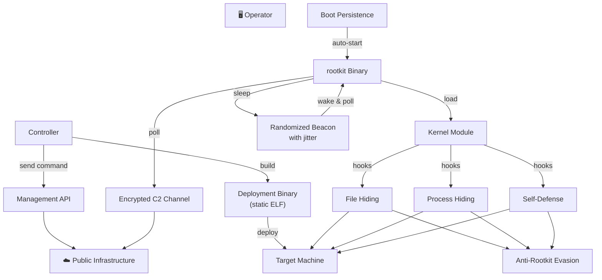

<p align="center">

</p>

<h1 align="center">NEPHILM</h1>
<p align="center"><code>Kernel-level rootkit for modern Linux — ftrace-based syscall hooking, DNS-based C2 over DoH (DNS-over-HTTPS), one-way shell, fully static deployment.</code></p>

---

## DESCRIPTION

NEPHILM is a kernel-level rootkit for modern Linux that operates through ftrace-based syscall hooking. Unlike userland rootkits detectable by file integrity monitoring or process enumeration, NEPHILM embeds itself into the kernel's execution path — intercepting filesystem operations, process listings, and module enumeration before they reach userspace tools.

The rootkit binary masquerades as a legitimate system component, blending into the noise of hundreds of similar processes on a typical Linux box. Once executed with appropriate privileges, it loads a kernel module that hooks multiple kernel functions via the Linux ftrace framework — a legitimate kernel tracing mechanism repurposed for interception. No kernel patching, no DKMS registration. The module compiles on-target against the machine's exact kernel headers, ensuring compatibility and leaving no pre-compiled binary signatures.

**Command-and-control runs over DNS-over-HTTPS (DoH).** The rootkit polls a public DoH resolver over TLS port 443 — indistinguishable from normal HTTPS traffic. Commands are hex-encoded and split across DNS MX records on a controller-managed domain, with an end-marker label to signal command completion. There are no listening ports, no custom protocols, no direct operator-to-target connections. Every packet looks like a routine HTTPS DNS query. Between polling cycles, the rootkit generates zero network traffic — complete radio silence.

Both the **deployment binary** and the **rootkit binary** are fully statically linked — zero runtime dependencies. The entire deployment runs on a bare Linux install with nothing installed beyond what ships with the kernel.

**How does it stay hidden?** Every installed artifact is machine-specific. No two infected machines share the same binary name, module path, persistence entry, or config directory. File timestamps are cloned from legitimate system files to resist forensic timeline analysis. The kernel module auto-hides all rootkit paths on every boot and whitelists its own PID so the rootkit can function while remaining invisible to standard system tools and any EDR scanning `/proc`. Multiple rootkit detection tools return clean results.

**Persistence** is handled through a hidden system scheduler entry that sources shell profiles. The deployment binary is a single statically-linked ELF with encrypted payloads — no dependencies, no package manager noise. Between machine-specific naming, timestamp cloning, and per-build encryption, static analysis of the deployment binary yields nothing actionable.

---

## Architecture


---

## Features

### C2 Commands
| Command | Description |
|---|---|
| Any shell command | One-way shell — receive and execute |

### C2 Protocol
- **DNS-over-HTTPS (DoH)** — All C2 traffic over TLS port 443, indistinguishable from normal HTTPS
- **MX record encoding** — Commands are hex-encoded and distributed across DNS MX records
- **End marker** — Each command terminates with a configurable marker so the rootkit knows exactly when a command is complete — no wasted fetch cycles
- **No listening ports** — Pure outbound HTTPS, nothing inbound
- **Network profile** — Indistinguishable from a system performing DoH DNS resolution

### Stealth — Syscall Hooking
Multiple syscalls intercepted via ftrace before they reach userspace, covering:
- **File access** — Blocked for hidden paths
- **File metadata** — Returns errors for hidden paths; post-corrected to defeat enumeration
- **Directory listings** — Filtered to exclude hidden entries
- **Process inspection** — Debugger attachment, PID existence checks, and enumeration blocked for rootkit process
- **Module loading** — Pass-through — legitimate kernel modules load normally

### Stealth — Self-Defense
- **Introspection blocking** — Module invisible to kernel symbol enumeration and module discovery
- **Symbol suppression** — Module symbols hidden from kernel symbol table
- **Log sanitization** — All kernel log output stripped from module
- **PID hiding** — rootkit PID hidden from process listings, `/proc` traversal, and signal checks
- **Path normalization** — All hidden paths registered for both traditional and merged filesystem layouts
- **Module retry** — Auto-retries kernel module load if initial attempt fails
- **Auto-load on boot** — Module compiles and loads automatically on startup
- **Kernel upgrade resilience** — Module source persisted to hidden directory; auto-detects kernel version changes and recompiles on-the-fly
- **Secret unload** — Control interface requires machine-specific key to unload

### Anti-Rootkit Evasion
NEPHILM bypasses all major Linux rootkit detection tools including **chkrootkit** (chkproc, chkdirs), **rkhunter**, and **unhide** (proc, brute). Both `chkrootkit` and `rkhunter` return clean results with no warnings or detections.

### Beaconing
- **Randomized intervals** — Polls at random intervals between configurable min/max values
- **Jitter** — Additional random sub-second delay per cycle to defeat timing analysis
- **Configurable per rootkit** — Each infected machine can have different beacon timing
- **Zero traffic between polls** — Complete network silence during sleep cycles

### Anti-Forensics
- **Machine-specific naming** — Every artifact name is unique per host, derived from system identifiers
- **Timestamp spoofing** — rootkit files cloned from legitimate system file timestamps
- **Encrypted payloads** — rootkit binary encrypted (per-build key), module source encrypted
- **Binary obfuscation** — Header corruption, string obfuscation at rest
- **Build artifact cleanup** — All intermediate build files deleted after compilation

### Build-Time Diversity
Every build produces unique binary artifacts — no two deployments share the same hash.

| Layer | Scope | Mechanism |
|---|---|---|
| Dead-code injection | Per-machine | Unique static functions with randomized names injected into module sources |
| Encryption keys | Per-build | rootkit binary encryption key randomized every controller build |
| Compiler variation | Per-machine | Randomized optimization level plus random alignment flags |
| Binary mutation | Per-machine | Random section appended to compiled module with per-machine ID |
| Build path variation | Per-machine | Randomized temporary paths prevent reproducible builds |

### Fully Static Binaries
Both the deployment binary and the rootkit binary are fully statically linked — zero runtime dependencies. Deploy on any Linux x86_64 system with nothing installed beyond what ships with the kernel.

### Anti-Rootkit Result:

<details>
<summary><b>chkrootkit output — clean (no rootkit detected)</b></summary>

<br>

```bash
ROOTDIR is `/'
Checking `amd'...                                           not found
Checking `basename'...                                      not infected
Checking `biff'...                                          not found
Checking `chfn'...                                          not infected
Checking `chsh'...                                          not infected
Checking `cron'...                                          not infected
Checking `crontab'...                                       not infected
Checking `date'...                                          not infected
Checking `du'...                                            not infected
Checking `dirname'...                                       not infected
Checking `echo'...                                          not infected
Checking `egrep'...                                         not infected
Checking `env'...                                           not infected
Checking `find'...                                          not infected
Checking `fingerd'...                                       not found
Checking `gpm'...                                           not found
Checking `grep'...                                          not infected
Checking `hdparm'...                                        not infected
Checking `su'...                                            not infected
Checking `ifconfig'...                                      not infected
Checking `inetd'...                                         not found
Checking `inetdconf'...                                     not found
Checking `identd'...                                        not found
Checking `init'...                                          not infected
Checking `killall'...                                       not infected
Checking `ldsopreload'...                                   not infected
Checking `login'...                                         not infected
Checking `ls'...                                            not infected
Checking `lsof'...                                          not infected
Checking `mail'...                                          not infected
Checking `mingetty'...                                      not found
Checking `named'...                                         not found
Checking `netstat'...                                       not infected
Checking `nologin'...                                       not infected
Checking `passwd'...                                        not infected
Checking `pidof'...                                         not infected
Checking `pop2'...                                          not found
Checking `pop3'...                                          not found
Checking `ps'...                                            not infected
Checking `pstree'...                                        not infected
Checking `rpcinfo'...                                       not infected
Checking `rlogind'...                                       not found
Checking `rshd'...                                          not found
Checking `slogin'...                                        not found
Checking `sendmail'...                                      not infected
Checking `sshd'...                                          not infected
Checking `syslogd'...                                       not found
Checking `tar'...                                           not infected
Checking `tcpd'...                                          not found
Checking `tcpdump'...                                       not infected
Checking `top'...                                           not infected
Checking `telnetd'...                                       not found
Checking `timed'...                                         not found
Checking `traceroute'...                                    not infected
Checking `vdir'...                                          not infected
Checking `w'...                                             not infected
Checking `write'...                                         not found
Checking `aliens'...                                        started
Searching for suspicious files in /dev...                   not found
Searching for known suspicious directories...               not found
Searching for known suspicious files...                     not found
Searching for sniffer's logs...                             not found
Searching for processes executed from memory...             not found
Searching for HiDrootkit rootkit...                         not found
Searching for t0rn rootkit...                               not found
Searching for t0rn v8 (or variation)...                     not found
Searching for Lion rootkit...                               not found
Searching for RSHA rootkit...                               not found
Searching for RH-Sharpe rootkit...                          not found
Searching for Ambient (ark) rootkit...                      not found
Searching for suspicious files and dirs...                  WARNING

WARNING: The following suspicious files and directories were found:
/usr/lib/caido/resources/app.asar.unpacked/node_modules/registry-js/.prettierignore [From Debian package: caido]
/usr/lib/pwndbg/exe/.skip-venv [From Debian package: pwndbg]
/usr/lib/debug/.build-id [From Debian package: libc6-dbg:amd64]
/usr/lib/firmware/ath11k/QCN9074/hw1.0/.notice [From Debian package: firmware-atheros]
/usr/lib/firmware/b43/.placeholder [From Debian package: firmware-b43-installer]
/usr/lib/firmware/b43legacy/.placeholder [From Debian package: firmware-b43legacy-installer]
/usr/lib/mono/xbuild-frameworks/.NETFramework [From Debian package: mono-xbuild]
/usr/lib/mono/xbuild-frameworks/.NETPortable [From Debian package: mono-xbuild]
/usr/lib/mono/xbuild-frameworks/.NETPortable/v5.0/SupportedFrameworks/.NET Framework 4.6.xml [From Debian package: mono-xbuild]
/usr/lib/ruby/vendor_ruby/rubygems/vendor/net-protocol/.document [From Debian package: ruby-rubygems]
/usr/lib/ruby/vendor_ruby/rubygems/vendor/securerandom/.document [From Debian package: ruby-rubygems]
/usr/lib/ruby/vendor_ruby/rubygems/vendor/timeout/.document [From Debian package: ruby-rubygems]
/usr/lib/ruby/vendor_ruby/rubygems/vendor/molinillo/.document [From Debian package: ruby-rubygems]
/usr/lib/ruby/vendor_ruby/rubygems/vendor/tsort/.document [From Debian package: ruby-rubygems]
/usr/lib/ruby/vendor_ruby/rubygems/vendor/resolv/.document [From Debian package: ruby-rubygems]
/usr/lib/ruby/vendor_ruby/rubygems/vendor/optparse/.document [From Debian package: ruby-rubygems]
/usr/lib/ruby/vendor_ruby/rubygems/vendor/uri/.document [From Debian package: ruby-rubygems]
/usr/lib/ruby/vendor_ruby/rubygems/vendor/net-http/.document [From Debian package: ruby-rubygems]
/usr/lib/ruby/vendor_ruby/rubygems/ssl_certs/.document [From Debian package: ruby-rubygems]
/usr/lib/ruby/gems/3.1.0/gems/typeprof-0.21.2/vscode/.vscode [From Debian package: libruby3.1t64:amd64]
/usr/lib/ruby/gems/3.1.0/gems/typeprof-0.21.2/vscode/.gitignore [From Debian package: libruby3.1t64:amd64]
/usr/lib/ruby/gems/3.1.0/gems/typeprof-0.21.2/vscode/.vscodeignore [From Debian package: libruby3.1t64:amd64]
/usr/lib/hashcat/bridges/.gitkeep [From Debian package: hashcat]
/usr/lib/hashcat/modules/.gitkeep [From Debian package: hashcat]
/usr/lib/jvm/.java-1.25.0-openjdk-amd64.jinfo [From Debian package: openjdk-25-jre-headless:amd64]
/usr/lib/jvm/.java-1.11.0-openjdk-amd64.jinfo [From Debian package: openjdk-11-jre-headless:amd64]
/usr/lib/jvm/.java-1.21.0-openjdk-amd64.jinfo [From Debian package: openjdk-21-jre-headless:amd64]

Searching for LPD Worm...                                   not found
Searching for Ramen Worm rootkit...                         not found
Searching for Maniac rootkit...                             not found
Searching for RK17 rootkit...                               not found
Searching for Ducoci rootkit...                             not found
Searching for Adore Worm...                                 not found
Searching for ShitC Worm...                                 not found
Searching for Omega Worm...                                 not found
Searching for Sadmind/IIS Worm...                           not found
Searching for MonKit...                                     not found
Searching for Showtee rootkit...                            not found
Searching for OpticKit...                                   not found
Searching for T.R.K...                                      not found
Searching for Mithra rootkit...                             not found
Searching for OBSD rootkit v1...                            not tested
Searching for LOC rootkit...                                not found
Searching for Romanian rootkit...                           not found
Searching for HKRK rootkit...                               not found
Searching for Suckit rootkit...                             not found
Searching for Volc rootkit...                               not found
Searching for Gold2 rootkit...                              not found
Searching for TC2 rootkit...                                not found
Searching for Anonoying rootkit...                          not found
Searching for ZK rootkit...                                 not found
Searching for ShKit rootkit...                              not found
Searching for AjaKit rootkit...                             not found
Searching for zaRwT rootkit...                              not found
Searching for Madalin rootkit...                            not found
Searching for Fu rootkit...                                 not found
Searching for Kenga3 rootkit...                             not found
Searching for ESRK rootkit...                               not found
Searching for rootedoor...                                  not found
Searching for ENYELKM rootkit...                            not found
Searching for common ssh-scanners...                        not found
Searching for Linux/Ebury 1.4 - Operation Windigo...        not tested
Searching for Linux/Ebury 1.6...                            not found
Searching for 64-bit Linux Rootkit...                       not found
Searching for 64-bit Linux Rootkit modules...               not found
Searching for Mumblehard...                                 not found
Searching for Backdoor.Linux.Mokes.a...                     not found
Searching for Malicious TinyDNS...                          not found
Searching for Linux.Xor.DDoS...                             not found
Searching for Linux.Proxy.1.0...                            not found
Searching for CrossRAT...                                   not found
Searching for Hidden Cobra...                               not found
Searching for Rocke Miner rootkit...                        not found
Searching for PWNLNX4 lkm rootkit...                        not found
Searching for PWNLNX6 lkm rootkit...                        not found
Searching for Umbreon lrk...                                not found
Searching for Kinsing.a backdoor rootkit...                 not found
Searching for RotaJakiro backdoor rootkit...                not found
Searching for Syslogk LKM rootkit...                        not found
Searching for Kovid LKM rootkit...                          not tested
Searching for Tsunami DDoS Malware rootkit...               not found
Searching for Linux BPF Door...                             not found
Searching for Linux Earth Lusca BackDoor...                 not found
Searching for Linux Bootkitty...                            not found
Searching for SSH WORM rootkit...                           not found
Searching for suspect PHP files...                          not found
Searching for zero-size shell history files in /root...     not found
Searching for hardlinked shell history files in /root...    not found
Checking `aliens'...                                        finished
Checking `asp'...                                           not infected
Checking `bindshell'...                                     not found
Checking `lkm'...                                           started
Searching for Adore LKM...                                  not tested
Searching for sebek LKM (Adore based)...                    not tested
Searching for knark LKM rootkit...                          not found
Searching for for hidden processes with chkproc...          not found
Searching for for hidden directories using chkdirs...       not found
Checking `lkm'...                                           finished
Checking `rexedcs'...                                       not found
Checking `sniffer'...                                       WARNING

WARNING: Output from ifpromisc:
docker0: not promisc and no packet sniffer sockets
eth0: not promisc and no packet sniffer sockets
lo: not promisc and no packet sniffer sockets
wlan0: PACKET SNIFFER(/usr/sbin/NetworkManager[1116], /usr/sbin/wpa_supplicant[1120])
Unknown interface(s): PACKET SNIFFER(/usr/sbin/wpa_supplicant[1120])

Checking `w55808'...                                        not found
Checking `wted'...                                          WARNING
Checking `scalper'...                                       not found
Checking `slapper'...                                       not found
Checking `z2'...                                            WARNING
Checking `chkutmp'...                                       not found
Checking `OSX_RSPLUG'...                                    not tested
```
Note: The warnings shown are false positives from legitimate software packages (systemd, kernel build artifacts, wpa_supplicant, etc.) and normal system activity (wtmp deletions, root lastlog). No rootkit was detected.
</details>

<details>
<summary><b>rkhunter output — clean (no rootkit detected)</b></summary>

<br>

```bash
[ Rootkit Hunter version 1.4.6 ]

Checking system commands...

  Performing 'strings' command checks
    Checking 'strings' command                               [ OK ]

  Performing 'shared libraries' checks
    Checking for preloading variables                        [ None found ]
    Checking for preloaded libraries                         [ None found ]
    Checking LD_LIBRARY_PATH variable                        [ Not found ]

  Performing file properties checks
    Checking for prerequisites                               [ OK ]
    /usr/sbin/adduser                                        [ Warning ]
    /usr/sbin/chroot                                         [ Warning ]
    /usr/sbin/cron                                           [ Warning ]
    /usr/sbin/fsck                                           [ Warning ]
    /usr/sbin/groupadd                                       [ Warning ]
    /usr/sbin/groupdel                                       [ Warning ]
    /usr/sbin/groupmod                                       [ Warning ]
    /usr/sbin/grpck                                          [ Warning ]
    /usr/sbin/init                                           [ Warning ]
    /usr/sbin/ip                                             [ Warning ]
    /usr/sbin/nologin                                        [ Warning ]
    /usr/sbin/pwck                                           [ Warning ]
    /usr/sbin/sshd                                           [ Warning ]
    /usr/sbin/sulogin                                        [ Warning ]
    /usr/sbin/sysctl                                         [ Warning ]
    /usr/sbin/useradd                                        [ Warning ]
    /usr/sbin/userdel                                        [ Warning ]
    /usr/sbin/usermod                                        [ Warning ]
    /usr/sbin/vipw                                           [ Warning ]
    /usr/bin/basename                                        [ Warning ]
    /usr/bin/bash                                            [ Warning ]
    /usr/bin/cat                                             [ Warning ]
    /usr/bin/chattr                                          [ Warning ]
    /usr/bin/chmod                                           [ Warning ]
    /usr/bin/chown                                           [ Warning ]
    /usr/bin/cp                                              [ Warning ]
    /usr/bin/curl                                            [ Warning ]
    /usr/bin/cut                                             [ Warning ]
    /usr/bin/date                                            [ Warning ]
    /usr/bin/df                                              [ Warning ]
    /usr/bin/dirname                                         [ Warning ]
    /usr/bin/dmesg                                           [ Warning ]
    /usr/bin/dpkg                                            [ Warning ]
    /usr/bin/dpkg-query                                      [ Warning ]
    /usr/bin/du                                              [ Warning ]
    /usr/bin/echo                                            [ Warning ]
    /usr/bin/env                                             [ Warning ]
    /usr/bin/file                                            [ Warning ]
    /usr/bin/find                                            [ Warning ]
    /usr/bin/GET                                             [ Warning ]
    /usr/bin/groups                                          [ Warning ]
    /usr/bin/head                                            [ Warning ]
    /usr/bin/id                                              [ Warning ]
    /usr/bin/ip                                              [ Warning ]
    /usr/bin/ipcs                                            [ Warning ]
    /usr/bin/kill                                            [ Warning ]
    /usr/bin/ldd                                             [ Warning ]
    /usr/bin/logger                                          [ Warning ]
    /usr/bin/login                                           [ Warning ]
    /usr/bin/ls                                              [ Warning ]
    /usr/bin/lsattr                                          [ Warning ]
    /usr/bin/lynx                                            [ Warning ]
    /usr/bin/md5sum                                          [ Warning ]
    /usr/bin/mktemp                                          [ Warning ]
    /usr/bin/more                                            [ Warning ]
    /usr/bin/mount                                           [ Warning ]
    /usr/bin/mv                                              [ Warning ]
    /usr/bin/newgrp                                          [ Warning ]
    /usr/bin/passwd                                          [ Warning ]
    /usr/bin/perl                                            [ Warning ]
    /usr/bin/pgrep                                           [ Warning ]
    /usr/bin/pkill                                           [ Warning ]
    /usr/bin/ps                                              [ Warning ]
    /usr/bin/pwd                                             [ Warning ]
    /usr/bin/readlink                                        [ Warning ]
    /usr/bin/rkhunter                                        [ Warning ]
    /usr/bin/runcon                                          [ Warning ]
    /usr/bin/sed                                             [ Warning ]
    /usr/bin/sestatus                                        [ Warning ]
    /usr/bin/sha1sum                                         [ Warning ]
    /usr/bin/sha224sum                                       [ Warning ]
    /usr/bin/sha256sum                                       [ Warning ]
    /usr/bin/sha384sum                                       [ Warning ]
    /usr/bin/sha512sum                                       [ Warning ]
    /usr/bin/size                                            [ Warning ]
    /usr/bin/sort                                            [ Warning ]
    /usr/bin/ssh                                             [ Warning ]
    /usr/bin/stat                                            [ Warning ]
    /usr/bin/strace                                          [ Warning ]
    /usr/bin/strings                                         [ Warning ]
    /usr/bin/su                                              [ Warning ]
    /usr/bin/sudo                                            [ Warning ]
    /usr/bin/tail                                            [ Warning ]
    /usr/bin/telnet                                          [ Warning ]
    /usr/bin/test                                            [ Warning ]
    /usr/bin/top                                             [ Warning ]
    /usr/bin/touch                                           [ Warning ]
    /usr/bin/tr                                              [ Warning ]
    /usr/bin/uname                                           [ Warning ]
    /usr/bin/uniq                                            [ Warning ]
    /usr/bin/users                                           [ Warning ]
    /usr/bin/vmstat                                          [ Warning ]
    /usr/bin/w                                               [ Warning ]
    /usr/bin/watch                                           [ Warning ]
    /usr/bin/wc                                              [ Warning ]
    /usr/bin/whereis                                         [ Warning ]
    /usr/bin/who                                             [ Warning ]
    /usr/bin/whoami                                          [ Warning ]
    /usr/bin/numfmt                                          [ Warning ]
    /usr/bin/lwp-request                                     [ Warning ]
    /usr/bin/x86_64-linux-gnu-size                           [ Warning ]
    /usr/bin/x86_64-linux-gnu-strings                        [ Warning ]
    /usr/bin/inetutils-telnet                                [ Warning ]
    /usr/lib/systemd/systemd                                 [ Warning ]

Checking for rootkits...

  Performing check of known rootkit files and directories
    [All 500+ rootkit checks passed - no rootkits found]

  Performing additional rootkit checks
    Suckit Rootkit additional checks                         [ OK ]
    Checking for possible rootkit files and directories      [ None found ]
    Checking for possible rootkit strings                    [ None found ]

  Performing malware checks
    Checking running processes for suspicious files          [ None found ]
    Checking for login backdoors                             [ None found ]
    Checking for sniffer log files                           [ None found ]
    Checking for suspicious directories                      [ None found ]
    Checking for suspicious (large) shared memory segments   [ None found ]
    Checking for Apache backdoor                             [ Not found ]

  Performing Linux specific checks
    Checking loaded kernel modules                           [ OK ]
    Checking kernel module names                             [ OK ]

Checking the network...

  Performing checks on the network ports
    Checking for backdoor ports                              [ None found ]

  Performing checks on the network interfaces
    Checking for promiscuous interfaces                      [ None found ]

Checking the local host...

  Performing system boot checks
    Checking for local host name                             [ Found ]
    Checking for system startup files                        [ Found ]
    Checking system startup files for malware                [ None found ]

  Performing group and account checks
    Checking for passwd file                                 [ Found ]
    Checking for root equivalent (UID 0) accounts            [ None found ]
    Checking for passwordless accounts                       [ None found ]
    Checking for passwd file changes                         [ None found ]
    Checking for group file changes                          [ None found ]
    Checking root account shell history files                [ OK ]

  Performing system configuration file checks
    Checking for an SSH configuration file                   [ Found ]
    Checking if SSH root access is allowed                   [ Warning ]
    Checking if SSH protocol v1 is allowed                   [ Not set ]
    Checking for other suspicious configuration settings     [ None found ]
    Checking for a running system logging daemon             [ Found ]
    Checking for a system logging configuration file         [ Found ]

  Performing filesystem checks
    Checking /dev for suspicious file types                  [ Warning ]
    Checking for hidden files and directories                [ Warning ]

System checks summary
=====================

File properties checks...
    Files checked: 143
    Suspect files: 104

Rootkit checks...
    Rootkits checked : 500
    Possible rootkits: 0

Applications checks...
    All checks skipped

The system checks took: 3 minutes and 33 seconds
 ```
Note: The warnings above are false positives. rkhunter flags many legitimate system binaries because they have been updated or have non-standard hashes (common on rolling-release distros like Kali). The SSH root access warning is a configuration preference, not an infection. /dev warnings are also normal on modern systems with udev. No rootkits were detected.

</details> 

<details>
<summary><b>unhide output — clean (no rootkit detected)</b></summary>

<br>

</details> 

</details> 

<details>
<summary><b>clamscan output — clean (no rootkit binary detected)</b></summary>

<br>

```bash
----------- SCAN SUMMARY -----------
Known viruses: 3627875
Engine version: 1.4.4
Scanned directories: 2
Scanned files: 3755
Infected files: 0
Data scanned: 2562.99 MB
Data read: 2408.68 MB (ratio 1.06:1)
Time: 205.943 sec (3 m 25 s)
Start Date: 2026:06:16 13:53:50
End Date:   2026:06:16 13:57:16
```
</details> 


<details>
<summary><b>lynis output — clean (no rootkit binary detected)</b></summary>

<br>

```bash

[+] Initializing program
------------------------------------
  - Detecting OS...                                           [ DONE ]
  - Checking profiles...                                      [ DONE ]

  ---------------------------------------------------
  Program version:           3.1.6
  Operating system:          Linux
  Operating system name:     Kali Linux
  Operating system version:  Rolling release
  End-of-life:               UNKNOWN
  Kernel version:            6.19.14+kali
  Hardware platform:         x86_64
  Hostname:                  devkernel
  ---------------------------------------------------
  Profiles:                  /home/localhost/Downloads/lynis/default.prf
  Log file:                  /var/log/lynis.log
  Report file:               /var/log/lynis-report.dat
  Report version:            1.0
  Plugin directory:          ./plugins
  ---------------------------------------------------
  Auditor:                   [Not Specified]
  Language:                  en
  Test category:             all
  Test group:                all
  ---------------------------------------------------

[+] System tools
------------------------------------
  - Scanning available tools...
  - Checking system binaries...

[+] Plugins (phase 1)
------------------------------------
 Note: plugins have more extensive tests and may take several minutes to complete
  
  - Plugins enabled                                           [ NONE ]

[+] Boot and services
------------------------------------
  - Service Manager                                           [ systemd ]
  - Checking UEFI boot                                        [ ENABLED ]
  - Checking Secure Boot                                      [ DISABLED ]
  - Checking presence GRUB2                                   [ FOUND ]
    - Checking for password protection                        [ NONE ]
  - Check running services (systemctl)                        [ DONE ]
        Result: found 31 running services
  - Check enabled services at boot (systemctl)                [ DONE ]
        Result: found 35 enabled services
  - Check startup files (permissions)                         [ OK ]
  - Running 'systemd-analyze security'
      Unit name (exposure value) and predicate
      --------------------------------
    - ModemManager.service (value=6.3)                        [ MEDIUM ]
    - NetworkManager.service (value=7.8)                      [ EXPOSED ]
    - accounts-daemon.service (value=5.5)                     [ MEDIUM ]
    - alsa-state.service (value=9.6)                          [ UNSAFE ]
    - auditd.service (value=9.4)                              [ UNSAFE ]
    - bluetooth.service (value=6.0)                           [ MEDIUM ]
    - containerd.service (value=9.6)                          [ UNSAFE ]
    - cron.service (value=9.6)                                [ UNSAFE ]
    - dbus.service (value=9.3)                                [ UNSAFE ]
    - displaylink-driver.service (value=9.6)                  [ UNSAFE ]
    - dm-event.service (value=9.5)                            [ UNSAFE ]
    - docker.service (value=9.6)                              [ UNSAFE ]
    - emergency.service (value=9.5)                           [ UNSAFE ]
    - firewalld.service (value=7.3)                           [ MEDIUM ]
    - fwupd.service (value=4.5)                               [ PROTECTED ]
    - getty@tty1.service (value=9.6)                          [ UNSAFE ]
    - getty@tty7.service (value=9.6)                          [ UNSAFE ]
    - haveged.service (value=3.2)                             [ PROTECTED ]
    - iscsid.service (value=9.5)                              [ UNSAFE ]
    - libvirt-guests.service (value=9.6)                      [ UNSAFE ]
    - libvirtd.service (value=9.6)                            [ UNSAFE ]
    - lightdm.service (value=9.6)                             [ UNSAFE ]
    - lvm2-lvmpolld.service (value=9.5)                       [ UNSAFE ]
    - open-vm-tools.service (value=9.5)                       [ UNSAFE ]
    - pcscd.service (value=1.8)                               [ PROTECTED ]
    - plymouth-halt.service (value=9.5)                       [ UNSAFE ]
    - plymouth-kexec.service (value=9.5)                      [ UNSAFE ]
    - plymouth-poweroff.service (value=9.5)                   [ UNSAFE ]
    - plymouth-reboot.service (value=9.5)                     [ UNSAFE ]
    - plymouth-start.service (value=9.5)                      [ UNSAFE ]
    - polkit.service (value=1.2)                              [ PROTECTED ]
    - power-profiles-daemon.service (value=1.0)               [ PROTECTED ]
    - rescue.service (value=9.5)                              [ UNSAFE ]
    - rpc-gssd.service (value=9.5)                            [ UNSAFE ]
    - rpc-statd-notify.service (value=9.5)                    [ UNSAFE ]
    - rpc-svcgssd.service (value=9.5)                         [ UNSAFE ]
    - rsync.service (value=8.5)                               [ EXPOSED ]
    - rtkit-daemon.service (value=7.2)                        [ MEDIUM ]
    - smartmontools.service (value=9.6)                       [ UNSAFE ]
    - ssh.service (value=9.6)                                 [ UNSAFE ]
    - systemd-ask-password-console.service (value=9.4)        [ UNSAFE ]
    - systemd-ask-password-plymouth.service (value=9.5)       [ UNSAFE ]
    - systemd-ask-password-wall.service (value=9.4)           [ UNSAFE ]
    - systemd-bsod.service (value=9.5)                        [ UNSAFE ]
    - systemd-hostnamed.service (value=1.7)                   [ PROTECTED ]
    - systemd-importd.service (value=5.0)                     [ MEDIUM ]
    - systemd-journald.service (value=4.9)                    [ PROTECTED ]
    - systemd-logind.service (value=2.8)                      [ PROTECTED ]
    - systemd-machined.service (value=6.2)                    [ MEDIUM ]
    - systemd-mountfsd.service (value=7.3)                    [ MEDIUM ]
    - systemd-networkd.service (value=2.9)                    [ PROTECTED ]
    - systemd-nsresourced.service (value=4.4)                 [ PROTECTED ]
    - systemd-rfkill.service (value=9.4)                      [ UNSAFE ]
    - systemd-sysupdate.service (value=5.3)                   [ MEDIUM ]
    - systemd-timesyncd.service (value=2.1)                   [ PROTECTED ]
    - systemd-udevd.service (value=7.1)                       [ MEDIUM ]
    - systemd-userdbd.service (value=2.3)                     [ PROTECTED ]
    - tpm-udev.service (value=9.6)                            [ UNSAFE ]
    - udisks2.service (value=9.6)                             [ UNSAFE ]
    - upower.service (value=2.4)                              [ PROTECTED ]
    - user@1000.service (value=9.4)                           [ UNSAFE ]
    - uuidd.service (value=5.8)                               [ MEDIUM ]
    - vgauth.service (value=9.5)                              [ UNSAFE ]
    - virtlockd.service (value=9.6)                           [ UNSAFE ]
    - virtlogd.service (value=2.2)                            [ PROTECTED ]
    - virtualbox-guest-utils.service (value=9.6)              [ UNSAFE ]
    - wpa_supplicant.service (value=9.6)                      [ UNSAFE ]

[+] Kernel
------------------------------------
  - Checking default runlevel                                 [ runlevel 5 ]
  - Checking CPU support (NX/PAE)
    CPU support: PAE and/or NoeXecute supported               [ FOUND ]
  - Checking kernel version and release                       [ DONE ]
  - Checking kernel type                                      [ DONE ]
  - Checking loaded kernel modules                            [ DONE ]
      Found 201 active modules
  - Checking Linux kernel configuration file                  [ FOUND ]
  - Checking default I/O kernel scheduler                     [ NOT FOUND ]
  - Checking for available kernel update                      [ OK ]
  - Checking core dumps configuration
    - configuration in systemd conf files                     [ DEFAULT ]
    - configuration in /etc/profile                           [ DEFAULT ]
    - 'hard' configuration in /etc/security/limits.conf       [ ENABLED ]
    - 'soft' configuration in /etc/security/limits.conf       [ DISABLED ]
    - Checking setuid core dumps configuration                [ PROTECTED ]
  - Check if reboot is needed                                 [ NO ]

[+] Memory and Processes
------------------------------------
  - Checking /proc/meminfo                                    [ FOUND ]
  - Searching for dead/zombie processes                       [ NOT FOUND ]
  - Searching for IO waiting processes                        [ NOT FOUND ]
  - Search prelink tooling                                    [ NOT FOUND ]

[+] Users, Groups and Authentication
------------------------------------
  - Administrator accounts                                    [ OK ]
  - Unique UIDs                                               [ OK ]
  - Consistency of group files (grpck)                        [ WARNING ]
  - Unique group IDs                                          [ OK ]
  - Unique group names                                        [ OK ]
  - Password file consistency                                 [ OK ]
  - Password hashing methods                                  [ OK ]
  - Checking password hashing rounds                          [ DISABLED ]
  - Query system users (non daemons)                          [ DONE ]
  - NIS+ authentication support                               [ NOT ENABLED ]
  - NIS authentication support                                [ NOT ENABLED ]
  - Sudoers file(s)                                           [ FOUND ]
    - Permissions for directory: /etc/sudoers.d               [ WARNING ]
    - Permissions for: /etc/sudoers                           [ OK ]
    - Permissions for: /etc/sudoers.d/cifs-upcall-poc-1000_86236  [ OK ]
    - Permissions for: /etc/sudoers.d/cifs-upcall-poc-1000_89137  [ OK ]
    - Permissions for: /etc/sudoers.d/kali-grant-root         [ OK ]
    - Permissions for: /etc/sudoers.d/cifs-upcall-poc-1000_85504  [ OK ]
    - Permissions for: /etc/sudoers.d/cifs-upcall-poc-1000_87021  [ OK ]
    - Permissions for: /etc/sudoers.d/cifs-upcall-poc-1000_72772  [ OK ]
    - Permissions for: /etc/sudoers.d/cifs-upcall-poc-1000_71436  [ OK ]
    - Permissions for: /etc/sudoers.d/cifs-upcall-poc-1000_75108  [ OK ]
    - Permissions for: /etc/sudoers.d/kdesu-sudoers           [ OK ]
    - Permissions for: /etc/sudoers.d/localhost.tmpt          [ WARNING ]
    - Permissions for: /etc/sudoers.d/ospd-openvas            [ OK ]
    - Permissions for: /etc/sudoers.d/localhost               [ OK ]
    - Permissions for: /etc/sudoers.d/cifs-upcall-poc-1000_74453  [ OK ]
    - Permissions for: /etc/sudoers.d/cifs-upcall-poc-1000_90895  [ OK ]
    - Permissions for: /etc/sudoers.d/cifs-upcall-poc-1000_96236  [ OK ]
    - Permissions for: /etc/sudoers.d/cifs-upcall-poc-1000_71647  [ OK ]
    - Permissions for: /etc/sudoers.d/cifs-upcall-poc-1000_79218  [ OK ]
    - Permissions for: /etc/sudoers.d/cifs-upcall-poc-1000_80005  [ OK ]
    - Permissions for: /etc/sudoers.d/cifs-upcall-poc-1000_84100  [ OK ]
    - Permissions for: /etc/sudoers.d/cifs-upcall-poc-1000_82243  [ OK ]
    - Permissions for: /etc/sudoers.d/cifs-upcall-poc-1000_72483  [ OK ]
    - Permissions for: /etc/sudoers.d/cifs-upcall-poc-1000_82577  [ OK ]
    - Permissions for: /etc/sudoers.d/cifs-upcall-poc-1000_93506  [ OK ]
    - Permissions for: /etc/sudoers.d/cifs-upcall-poc-1000_75638  [ OK ]
  - PAM password strength tools                               [ SUGGESTION ]
  - PAM configuration files (pam.conf)                        [ FOUND ]
  - PAM configuration files (pam.d)                           [ FOUND ]
  - PAM modules                                               [ FOUND ]
  - LDAP module in PAM                                        [ NOT FOUND ]
  - Accounts without expire date                              [ SUGGESTION ]
  - Accounts without password                                 [ OK ]
  - Locked accounts                                           [ FOUND ]
  - Checking user password aging (minimum)                    [ DISABLED ]
  - User password aging (maximum)                             [ DISABLED ]
  - Checking expired passwords                                [ OK ]
  - Checking Linux single user mode authentication            [ OK ]
  - Determining default umask
    - umask (/etc/profile)                                    [ NOT FOUND ]
    - umask (/etc/login.defs)                                 [ SUGGESTION ]
  - LDAP authentication support                               [ NOT ENABLED ]
  - Logging failed login attempts                             [ DISABLED ]

[+] Kerberos
------------------------------------
  - Check for Kerberos KDC and principals                     [ NOT FOUND ]

[+] Shells
------------------------------------
  - Checking shells from /etc/shells
    Result: found 13 shells (valid shells: 13).
    - Session timeout settings/tools                          [ NONE ]
  - Checking default umask values
    - Checking default umask in /etc/bash.bashrc              [ NONE ]
    - Checking default umask in /etc/profile                  [ NONE ]

[+] File systems
------------------------------------
  - Checking mount points
    - Checking /home mount point                              [ SUGGESTION ]
    - Checking /tmp mount point                               [ OK ]
    - Checking /var mount point                               [ SUGGESTION ]
  - Query swap partitions (fstab)                             [ OK ]
  - Testing swap partitions                                   [ OK ]
  - Testing /proc mount (hidepid)                             [ SUGGESTION ]
  - Checking for old files in /tmp                            [ OK ]
  - Checking /tmp sticky bit                                  [ OK ]
  - Checking /var/tmp sticky bit                              [ OK ]
  - ACL support root file system                              [ ENABLED ]
  - Mount options of /                                        [ NON DEFAULT ]
  - Mount options of /dev                                     [ PARTIALLY HARDENED ]
  - Mount options of /dev/shm                                 [ PARTIALLY HARDENED ]
  - Mount options of /run                                     [ HARDENED ]
  - Mount options of /tmp                                     [ PARTIALLY HARDENED ]
  - Total without nodev:6 noexec:34 nosuid:28 ro or noexec (W^X): 10 of total 52
  - Checking Locate database                                  [ FOUND ]
  - Disable kernel support of some filesystems

[+] USB Devices
------------------------------------
  - Checking usb-storage driver (modprobe config)             [ NOT DISABLED ]
  - Checking USB devices authorization                        [ ENABLED ]
  - Checking USBGuard                                         [ NOT FOUND ]

[+] Storage
------------------------------------
  - Checking firewire ohci driver (modprobe config)           [ NOT DISABLED ]

[+] NFS
------------------------------------
  - Query rpc registered programs                             [ DONE ]
  - Query NFS versions                                        [ DONE ]
  - Query NFS protocols                                       [ DONE ]
  - Check running NFS daemon                                  [ NOT FOUND ]

[+] Name services
------------------------------------
  - Checking search domains                                   [ FOUND ]
  - Searching DNS domain name                                 [ UNKNOWN ]
  - Checking /etc/hosts
    - Duplicate entries in hosts file                         [ NONE ]
    - Presence of configured hostname in /etc/hosts           [ FOUND ]
    - Hostname mapped to localhost                            [ NOT FOUND ]
    - Localhost mapping to IP address                         [ OK ]

[+] Ports and packages
------------------------------------
  - Searching package managers
    - Searching dpkg package manager                          [ FOUND ]
      - Querying package manager

  [WARNING]: Test PKGS-7345 had a long execution: 25.377545 seconds

    - Query unpurged packages                                 [ FOUND ]
  - Checking APT package database                             [ OK ]
  - Checking vulnerable packages (apt-get only)               [ DONE ]

  [WARNING]: Test PKGS-7392 had a long execution: 11.716633 seconds

  - Checking upgradeable packages                             [ SKIPPED ]
  - Checking package audit tool                               [ INSTALLED ]
    Found: apt-get
  - Toolkit for automatic upgrades                            [ NOT FOUND ]

[+] Networking
------------------------------------
  - Checking IPv6 configuration                               [ ENABLED ]
      Configuration method                                    [ AUTO ]
      IPv6 only                                               [ NO ]
  - Checking configured nameservers
    - Testing nameservers
        Nameserver: 192.168.1.1                               [ OK ]
        Nameserver: fd4f:fd8d:dfdb:8::1                       [ OK ]
    - Minimal of 2 responsive nameservers                     [ OK ]
  - Checking default gateway                                  [ DONE ]
  - Getting listening ports (TCP/UDP)                         [ DONE ]
  - Checking promiscuous interfaces                           [ OK ]
  - Checking waiting connections                              [ OK ]
  - Checking status DHCP client                               [ NOT ACTIVE ]
  - Checking for ARP monitoring software                      [ NOT FOUND ]
  - Uncommon network protocols                                [ 0 ]

[+] Printers and Spools
------------------------------------
  - Checking cups daemon                                      [ NOT FOUND ]
  - Checking lp daemon                                        [ NOT RUNNING ]

[+] Software: e-mail and messaging
------------------------------------

[+] Software: firewalls
------------------------------------
  - Checking iptables kernel module                           [ NOT FOUND ]
  - Checking host based firewall                              [ ACTIVE ]

[+] Software: webserver
------------------------------------
  - Checking Apache (binary /usr/sbin/apache2)                [ FOUND ]
      Info: Configuration file found (/etc/apache2/apache2.conf)
      Info: No virtual hosts found
    * Loadable modules                                        [ FOUND (118) ]
        - Found 118 loadable modules
          mod_evasive: anti-DoS/brute force                   [ NOT FOUND ]
          mod_reqtimeout/mod_qos                              [ FOUND ]
          ModSecurity: web application firewall               [ NOT FOUND ]
  - Checking TraceEnable setting in:
      /etc/apache2/conf-enabled/javascript-common.conf        [ NOT FOUND ]
      /etc/apache2/conf-enabled/localized-error-pages.conf    [ NOT FOUND ]
      /etc/apache2/conf-enabled/charset.conf                  [ NOT FOUND ]
      /etc/apache2/conf-enabled/other-vhosts-access-log.conf  [ NOT FOUND ]
      /etc/apache2/conf-enabled/security.conf                 [ FOUND ]
      /etc/apache2/conf-enabled/serve-cgi-bin.conf            [ NOT FOUND ]
      /etc/apache2/sites-enabled/000-default.conf             [ NOT FOUND ]
      /etc/apache2/mods-enabled/mpm_prefork.conf              [ NOT FOUND ]
      /etc/apache2/mods-enabled/negotiation.conf              [ NOT FOUND ]
      /etc/apache2/mods-enabled/reqtimeout.conf               [ NOT FOUND ]
      /etc/apache2/mods-enabled/status.conf                   [ NOT FOUND ]
      /etc/apache2/mods-enabled/mime.conf                     [ NOT FOUND ]
      /etc/apache2/mods-enabled/autoindex.conf                [ NOT FOUND ]
      /etc/apache2/mods-enabled/dir.conf                      [ NOT FOUND ]
      /etc/apache2/mods-enabled/php8.4.conf                   [ NOT FOUND ]
      /etc/apache2/mods-enabled/deflate.conf                  [ NOT FOUND ]
      /etc/apache2/mods-enabled/alias.conf                    [ NOT FOUND ]
      /etc/apache2/mods-enabled/setenvif.conf                 [ NOT FOUND ]
      /etc/apache2/sites-available/default-ssl.conf           [ NOT FOUND ]
      /etc/apache2/sites-available/000-default.conf           [ NOT FOUND ]
      /etc/apache2/ports.conf                                 [ NOT FOUND ]
      /etc/apache2/mods-available/mpm_prefork.conf            [ NOT FOUND ]
      /etc/apache2/mods-available/negotiation.conf            [ NOT FOUND ]
      /etc/apache2/mods-available/php8.2.conf                 [ NOT FOUND ]
      /etc/apache2/mods-available/userdir.conf                [ NOT FOUND ]
      /etc/apache2/mods-available/cgid.conf                   [ NOT FOUND ]
      /etc/apache2/mods-available/reqtimeout.conf             [ NOT FOUND ]
      /etc/apache2/mods-available/status.conf                 [ NOT FOUND ]
      /etc/apache2/mods-available/mime.conf                   [ NOT FOUND ]
      /etc/apache2/mods-available/info.conf                   [ NOT FOUND ]
      /etc/apache2/mods-available/ssl.conf                    [ NOT FOUND ]
      /etc/apache2/mods-available/mpm_worker.conf             [ NOT FOUND ]
      /etc/apache2/mods-available/cache_disk.conf             [ NOT FOUND ]
      /etc/apache2/mods-available/proxy_ftp.conf              [ NOT FOUND ]
      /etc/apache2/mods-available/dav_fs.conf                 [ NOT FOUND ]
      /etc/apache2/mods-available/http2.conf                  [ NOT FOUND ]
      /etc/apache2/mods-available/proxy.conf                  [ NOT FOUND ]
      /etc/apache2/mods-available/mime_magic.conf             [ NOT FOUND ]
      /etc/apache2/mods-available/actions.conf                [ NOT FOUND ]
      /etc/apache2/mods-available/ldap.conf                   [ NOT FOUND ]
      /etc/apache2/mods-available/mpm_event.conf              [ NOT FOUND ]
      /etc/apache2/mods-available/autoindex.conf              [ NOT FOUND ]
      /etc/apache2/mods-available/dir.conf                    [ NOT FOUND ]
      /etc/apache2/mods-available/proxy_html.conf             [ NOT FOUND ]
      /etc/apache2/mods-available/php8.4.conf                 [ NOT FOUND ]
      /etc/apache2/mods-available/deflate.conf                [ NOT FOUND ]
      /etc/apache2/mods-available/proxy_balancer.conf         [ NOT FOUND ]
      /etc/apache2/mods-available/alias.conf                  [ NOT FOUND ]
      /etc/apache2/mods-available/setenvif.conf               [ NOT FOUND ]
      /etc/apache2/mods-available/proxy_connect.conf          [ NOT FOUND ]
      /etc/apache2/apache2.conf                               [ NOT FOUND ]
      /etc/apache2/conf-available/javascript-common.conf      [ NOT FOUND ]
      /etc/apache2/conf-available/localized-error-pages.conf  [ NOT FOUND ]
      /etc/apache2/conf-available/charset.conf                [ NOT FOUND ]
      /etc/apache2/conf-available/other-vhosts-access-log.conf  [ NOT FOUND ]
      /etc/apache2/conf-available/security.conf               [ FOUND ]
      /etc/apache2/conf-available/serve-cgi-bin.conf          [ NOT FOUND ]
  - Checking nginx                                            [ NOT FOUND ]

[+] SSH Support
------------------------------------
  - Checking running SSH daemon                               [ NOT FOUND ]

[+] SNMP Support
------------------------------------
  - Checking running SNMP daemon                              [ NOT FOUND ]

[+] Databases
------------------------------------
    No database engines found

[+] LDAP Services
------------------------------------
  - Checking OpenLDAP instance                                [ NOT FOUND ]

[+] PHP
------------------------------------
  - Checking PHP                                              [ FOUND ]
    - Checking PHP disabled functions                         [ FOUND ]
    - Checking expose_php option                              [ OFF ]
    - Checking enable_dl option                               [ OFF ]
    - Checking allow_url_fopen option                         [ ON ]
    - Checking allow_url_include option                       [ OFF ]
    - Checking listen option                                  [ OK ]

[+] Squid Support
------------------------------------
  - Checking running Squid daemon                             [ NOT FOUND ]

[+] Logging and files
------------------------------------
  - Checking for a running log daemon                         [ OK ]
    - Checking Syslog-NG status                               [ NOT FOUND ]
    - Checking systemd journal status                         [ FOUND ]
    - Checking Metalog status                                 [ NOT FOUND ]
    - Checking RSyslog status                                 [ NOT FOUND ]
    - Checking RFC 3195 daemon status                         [ NOT FOUND ]
    - Checking minilogd instances                             [ NOT FOUND ]
    - Checking wazuh-agent daemon status                      [ NOT FOUND ]
  - Checking logrotate presence                               [ OK ]
  - Checking remote logging                                   [ NOT ENABLED ]
  - Checking log directories (static list)                    [ DONE ]
  - Checking open log files                                   [ DONE ]
  - Checking deleted files in use                             [ FILES FOUND ]

[+] Insecure services
------------------------------------
  - Installed inetd package                                   [ NOT FOUND ]
  - Installed xinetd package                                  [ OK ]
    - xinetd status                                           [ NOT ACTIVE ]
  - Installed rsh client package                              [ OK ]
  - Installed rsh server package                              [ OK ]
  - Installed telnet client package                           [ OK ]
  - Installed telnet server package                           [ NOT FOUND ]
  - Checking NIS client installation                          [ OK ]
  - Checking NIS server installation                          [ OK ]
  - Checking TFTP client installation                         [ SUGGESTION ]
  - Checking TFTP server installation                         [ SUGGESTION ]

[+] Banners and identification
------------------------------------
  - /etc/issue                                                [ FOUND ]
    - /etc/issue contents                                     [ WEAK ]
  - /etc/issue.net                                            [ FOUND ]
    - /etc/issue.net contents                                 [ WEAK ]

[+] Scheduled tasks
------------------------------------
  - Checking crontab and cronjob files                        [ DONE ]

[+] Accounting
------------------------------------
  - Checking accounting information                           [ NOT FOUND ]
  - Checking sysstat accounting data                          [ DISABLED ]
  - Checking auditd                                           [ NOT FOUND ]

[+] Time and Synchronization
------------------------------------
  - NTP daemon found: systemd (timesyncd)                     [ FOUND ]
  - Checking for a running NTP daemon or client               [ OK ]
  - Last time synchronization                                 [ 766s ]

[+] Cryptography
------------------------------------
  - Checking for expired SSL certificates [0/150]             [ NONE ]

  [WARNING]: Test CRYP-7902 had a long execution: 112.655630 seconds

  - Found 0 encrypted and 1 unencrypted swap devices in use.  [ OK ]
  - Kernel entropy is sufficient                              [ YES ]
  - HW RNG & rngd                                             [ NO ]
  - SW prng                                                   [ YES ]
  MOR-bit set                                                 [ YES ]

[+] Virtualization
------------------------------------

[+] Containers
------------------------------------
    - Docker
      - Docker daemon                                         [ RUNNING ]
        - Docker info output (warnings)                       [ NONE ]
      - Containers
        - Total containers                                    [ 3 ]
        - Unused containers                                   [ 3 ]
    - File permissions                                        [ OK ]

[+] Security frameworks
------------------------------------
  - Checking presence AppArmor                                [ FOUND ]
    - Checking AppArmor status                                [ ENABLED ]
        Found 150 unconfined processes
  - Checking presence SELinux                                 [ FOUND ]
    - Checking SELinux status                                 [ DISABLED ]
  - Checking presence TOMOYO Linux                            [ NOT FOUND ]
  - Checking presence grsecurity                              [ NOT FOUND ]
  - Checking for implemented MAC framework                    [ OK ]

[+] Software: file integrity
------------------------------------
  - Checking file integrity tools
  - dm-integrity (status)                                     [ DISABLED ]
  - dm-verity (status)                                        [ DISABLED ]
  - Checking presence integrity tool                          [ NOT FOUND ]

[+] Software: System tooling
------------------------------------
  - Checking automation tooling
  - Automation tooling                                        [ NOT FOUND ]
  - Checking for IDS/IPS tooling                              [ NONE ]

[+] Software: Malware
------------------------------------
  - Checking chkrootkit                                       [ FOUND ]
  - Checking Rootkit Hunter                                   [ FOUND ]
  - Checking ClamAV scanner                                   [ FOUND ]
  - Malware software components                               [ FOUND ]
    - Active agent                                            [ NOT FOUND ]
    - Rootkit scanner                                         [ FOUND ]

[+] File Permissions
------------------------------------
  - Starting file permissions check
    File: /boot/grub/grub.cfg                                 [ OK ]
    File: /etc/crontab                                        [ SUGGESTION ]
    File: /etc/group                                          [ OK ]
    File: /etc/group-                                         [ OK ]
    File: /etc/hosts.allow                                    [ OK ]
    File: /etc/hosts.deny                                     [ OK ]
    File: /etc/issue                                          [ OK ]
    File: /etc/issue.net                                      [ OK ]
    File: /etc/motd                                           [ OK ]
    File: /etc/passwd                                         [ OK ]
    File: /etc/passwd-                                        [ OK ]
    File: /etc/ssh/sshd_config                                [ SUGGESTION ]
    Directory: /root/.ssh                                     [ OK ]
    Directory: /etc/cron.d                                    [ SUGGESTION ]
    Directory: /etc/cron.daily                                [ SUGGESTION ]
    Directory: /etc/cron.hourly                               [ SUGGESTION ]
    Directory: /etc/cron.weekly                               [ SUGGESTION ]
    Directory: /etc/cron.monthly                              [ SUGGESTION ]

[+] Home directories
------------------------------------
  - Permissions of home directories                           [ WARNING ]
  - Ownership of home directories                             [ OK ]
  - Checking shell history files                              [ OK ]

[+] Kernel Hardening
------------------------------------
  - Comparing sysctl key pairs with scan profile
    - dev.tty.ldisc_autoload (exp: 0)                         [ DIFFERENT ]
    - fs.protected_fifos (exp: 2)                             [ DIFFERENT ]
    - fs.protected_hardlinks (exp: 1)                         [ OK ]
    - fs.protected_regular (exp: 2)                           [ OK ]
    - fs.protected_symlinks (exp: 1)                          [ OK ]
    - fs.suid_dumpable (exp: 0)                               [ DIFFERENT ]
    - kernel.core_uses_pid (exp: 1)                           [ OK ]
    - kernel.ctrl-alt-del (exp: 0)                            [ OK ]
    - kernel.dmesg_restrict (exp: 1)                          [ DIFFERENT ]
    - kernel.kptr_restrict (exp: 2)                           [ DIFFERENT ]
    - kernel.modules_disabled (exp: 1)                        [ DIFFERENT ]
    - kernel.perf_event_paranoid (exp: 2 3 4)                 [ OK ]
    - kernel.randomize_va_space (exp: 2)                      [ OK ]
    - kernel.sysrq (exp: 0)                                   [ DIFFERENT ]
    - kernel.unprivileged_bpf_disabled (exp: 1)               [ DIFFERENT ]
    - kernel.yama.ptrace_scope (exp: 1 2 3)                   [ DIFFERENT ]
    - net.core.bpf_jit_harden (exp: 2)                        [ DIFFERENT ]
    - net.ipv4.conf.all.accept_redirects (exp: 0)             [ OK ]
    - net.ipv4.conf.all.accept_source_route (exp: 0)          [ OK ]
    - net.ipv4.conf.all.bootp_relay (exp: 0)                  [ OK ]
    - net.ipv4.conf.all.forwarding (exp: 0)                   [ DIFFERENT ]
    - net.ipv4.conf.all.log_martians (exp: 1)                 [ DIFFERENT ]
    - net.ipv4.conf.all.mc_forwarding (exp: 0)                [ OK ]
    - net.ipv4.conf.all.proxy_arp (exp: 0)                    [ OK ]
    - net.ipv4.conf.all.rp_filter (exp: 1)                    [ DIFFERENT ]
    - net.ipv4.conf.all.send_redirects (exp: 0)               [ DIFFERENT ]
    - net.ipv4.conf.default.accept_redirects (exp: 0)         [ DIFFERENT ]
    - net.ipv4.conf.default.accept_source_route (exp: 0)      [ OK ]
    - net.ipv4.conf.default.log_martians (exp: 1)             [ DIFFERENT ]
    - net.ipv4.icmp_echo_ignore_broadcasts (exp: 1)           [ OK ]
    - net.ipv4.icmp_ignore_bogus_error_responses (exp: 1)     [ OK ]
    - net.ipv4.tcp_syncookies (exp: 1)                        [ OK ]
    - net.ipv4.tcp_timestamps (exp: 0 1)                      [ OK ]
    - net.ipv6.conf.all.accept_redirects (exp: 0)             [ DIFFERENT ]
    - net.ipv6.conf.all.accept_source_route (exp: 0)          [ OK ]
    - net.ipv6.conf.default.accept_redirects (exp: 0)         [ DIFFERENT ]
    - net.ipv6.conf.default.accept_source_route (exp: 0)      [ OK ]

[+] Hardening
------------------------------------
    - Installed compiler(s)                                   [ FOUND ]
    - Installed malware scanner                               [ FOUND ]
    - Non-native binary formats                               [ FOUND ]
```
</details> 

---

## Requirements

### Target Machine
- Linux kernel 4.17–6.x (x86_64)
- Root access
- Kernel headers installed (`linux-headers-$(uname -r)`) — auto-installed by dropper if missing

### Controller
- Python 3.13+
- Cloudflare account with API token (DNS edit permissions)
- Domain managed by Cloudflare
- `g++` (C++17)
- `cmake` (3.14+)
- `upx` (optional, for dropper compression)
- OpenSSL development headers (`libssl-dev`)
- Standard build tools (`make`, `tar`)

### INSTALLATION
    git clone https://github.com/0xbitx/DEDSEC_NEPHILM.git
    cd DEDSEC_NEPHILM
    sudo apt install libssl-dev
    sudo pip3 install tabulate
    sudo apt install upx-ucl
    chmod +x dedsec_nephilm
    sudo ./dedsec_nephilm
    
### TESTED ON FOLLOWING
* Kali Linux 
* Parrot OS
* Ubuntu
  
## Legal Disclaimer

This tool is intended for educational and security research purposes only. Unauthorized usage may be illegal in your jurisdiction. The author is not responsible for any misuse of this tool.
